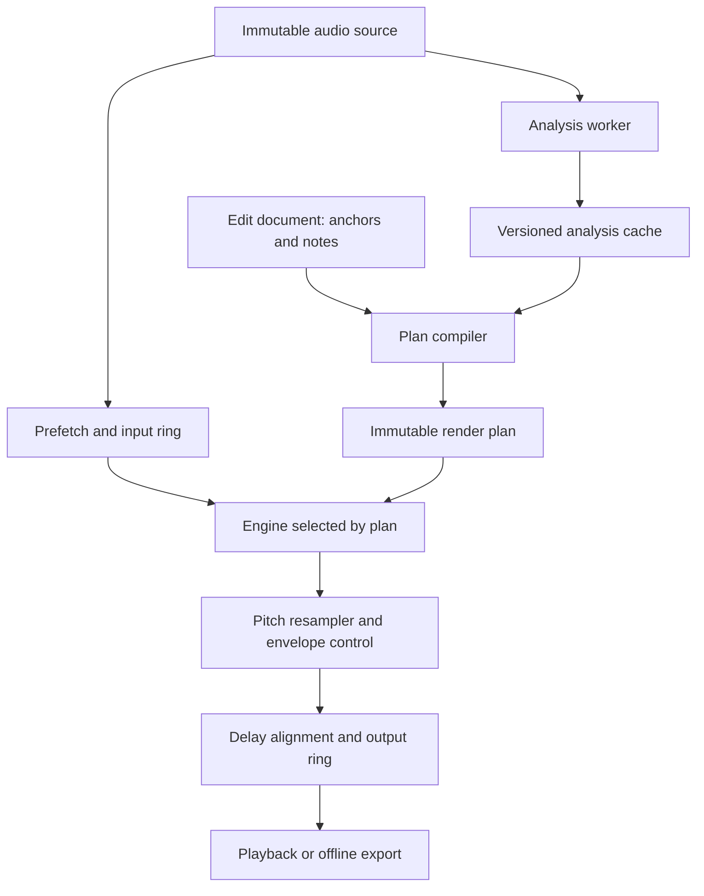

# System Design: Solfege Stretching

สถานะ **Proposed**, 2026-09-06 · [Research](research.md) · [DSP](dsp.md) · [Validation](validation.md)

## 1. ผลลัพธ์ที่ต้องการ

สร้างไลบรารี Rust สำหรับยืดเวลาและเปลี่ยน pitch ที่รองรับเสียงร้อง เครื่องดนตรี กลอง และ full mix พร้อม non-destructive edit document ผู้ใช้แก้ warp/pitch ได้หลายครั้งและ render จากต้นฉบับเสมอ

เริ่ม **offline WAV + CLI + measurement harness** เพื่อพิสูจน์ DSP; จากนั้นเพิ่ม playback จากไฟล์และ note editing GUI/plug-in integration เป็น consumer ของไลบรารี ไม่ผูก DSP กับ framework UI

~~โค้ดที่ตรวจขณะออกแบบเป็น Hello World~~ **ตรวจแล้วและ implement แล้ว** (ดู [Implementation](implementation.md)): workspace แม่ให้ `version 0.1.0`, `edition 2024`, `license Apache-2.0`, resolver 3 และ `serde`/`serde_json` เป็น workspace dependency; dependency ด้าน DSP ที่เลือกจริงคือ `rustfft` + `realfft` เท่านั้น ส่วน `eframe`/`cpal` อยู่หลัง feature `demo`

### ขอบเขตรุ่นแรก

| เรื่อง | กำหนด |
|---|---|
| Input ภายใน | planar `f32`, finite values, mono/stereo, sample rate เดียวตลอด render |
| File rates ที่ทดสอบ | 44.1/48/96 kHz; rate อื่นต้องประกาศ capability ก่อนรับ |
| Time | constant ratio และ monotonic piecewise-linear anchors |
| Pitch | constant semitone shift ก่อน; automation เพิ่มเมื่อ clock tests ผ่าน |
| โหมด | Bypass, Tape, WSOLA baseline; เพิ่ม Percussive/PV ตาม milestone |
| Target quality range | `alpha 0.5..2`, pitch ±12 semitones; เป็นช่วงทดสอบ ไม่รับรองเสียงทุกชนิด |
| Group processing | ออกแบบไว้ตั้งแต่ต้น; รับรองหลายไมค์หลัง group tests ผ่าน |
| ยังไม่อยู่รุ่นแรก | chord-note separation, source separation ทั้งวง, live microphone indefinite stretch, reverse warp, infinite hold |

## 2. User workflows

1. **Tempo:** เปิดไฟล์ → ยืนยัน source tempo/grid → ตั้ง destination tempo → preview → export
2. **Timing:** เพิ่ม anchor ที่หัวเสียง → ลาก destination โดย anchor รอบข้างล็อกอยู่ → preview เฉพาะช่วง → export
3. **Pitch:** ตั้ง transpose ทั้งคลิป → เลือก Follow/Preserve formants → เปรียบเทียบกับ original
4. **Vocal notes ระยะถัดไป:** analyze → แก้ขอบโน้ต/โน้ตที่ตรวจผิด → ปรับ center, drift, vibrato, gain → render
5. **Drum group ระยะถัดไป:** ผูก tracks ที่มี common origin/rate → ใช้ shared anchors → preview และฟัง mono sum ก่อน export

เมื่อ Auto ไม่มั่นใจ ให้แสดงว่าเลือก mode ใดและให้ override; ไม่มีการเปลี่ยนเสียงเงียบ ๆ เพราะ background analysis เปลี่ยนคำตอบระหว่างเล่น

## 3. Architecture



Tape ใช้ resampler โดยตรง ไม่ผ่าน pitch-independent stretch; Bypass copy samples; formant correction อยู่บนเส้นทางที่รองรับเท่านั้น diagram ไม่บังคับให้ทุก engine ผ่านทุก DSP node

### โมดูลที่เสนอ

| Module | หน้าที่ / invariant |
|---|---|
| `audio` | frame units, channel layout, immutable source descriptors |
| `document` | source-relative edits, undo/redo, schema migrations |
| `analysis` | onset, F0, voicing, envelope; ทำงานนอก audio callback |
| `mapping` | monotonic map, inverse, beat conversion, anchor validation |
| `plan` | compile engine schedule, protection windows, pitch clocks |
| `dsp` | windows, FFT adapter, OLA, correlation, resampler |
| `engines` | tape, wsola, slicing, pv, hybrid; capability table |
| `runtime` | preallocated buffers, process/drain/reset, timestamps |
| `render` | offline length reconciliation, streaming adapters |
| `cache` | analysis/render cache keys, atomic writes, cancellation |
| `cli` | IO และ testable commands; DSP library ไม่อ่านไฟล์เอง |

เริ่มเป็น modules ใน crate เดียวได้ ไม่ต้องสร้างหลาย crates ก่อนมีเหตุผลจาก profiling หรือ API boundary

## 4. Data model

```rust
// Contract sketch only: not implemented public API.
struct WarpAnchor {
    source_frame: u64,
    output_frame: u64,
    kind: AnchorKind, // Endpoint, User, or PromotedAnalysis
}

struct NoteEdit {
    id: NoteId,
    source_start: u64,
    source_end: u64, // exclusive
    pitch_shift_cents: f64,
    drift_start_cents: f64,
    drift_end_cents: f64,
    vibrato_scale: f64,
    gain_db: f64,
    formant: FormantPolicy,
}

struct EditDocument {
    schema_version: u32,
    source: SourceIdentity, // content hash, rate, channels, frame count
    anchors: Vec<WarpAnchor>,
    notes: Vec<NoteEdit>,
    mode: EngineMode,
    quality: QualityProfile,
    group: Option<GroupIdentity>,
}
```

Analysis note กับ NoteEdit เป็นคนละ object: note detection เปลี่ยนแล้วไม่ทับ user edits ต้องมี relink/review policy และ stable IDs; note ranges อ้าง **source time** ส่วน project pitch automation อ้าง **output time** พร้อม metadata ชัดเจน

### Serialization ตัวอย่าง

```json
{
  "schema_version": 1,
  "source": {
    "id": "example-source-id",
    "sample_rate": 48000,
    "channels": 2,
    "frames": 480000
  },
  "anchors": [
    { "source_frame": 0, "output_frame": 0, "kind": "endpoint" },
    { "source_frame": 240000, "output_frame": 288000, "kind": "user" },
    { "source_frame": 480000, "output_frame": 640000, "kind": "endpoint" }
  ],
  "mode": "polyphonic",
  "quality": "offline",
  "pitch_semitones": 0.0,
  "formant": "follow_pitch",
  "notes": []
}
```

ตัวอย่าง schema ยังไม่ final และ `id` ไม่ใช่ content hash จริง; implementation ต้องเก็บ/ตรวจ source hash และ serializer ของ pitch controls ให้ครบ ตัวอย่างนี้ช่วงแรก ratio 1.2 ช่วงหลัง 1.466666… รวม 4/3

## 5. Time-map contract

Anchors ใช้ **sample boundaries** ไม่ใช่ index ของ sample สุดท้าย: source `N` คือจุดจบ exclusive และ output endpoint `M` คือจำนวน output frames

สำหรับ anchors `(s_i,t_i)`:

```text
W(s) = t_i + (s-s_i)*(t_(i+1)-t_i)/(s_(i+1)-s_i)
```

- ต้อง `s_(i+1)>s_i` และ `t_(i+1)>t_i`; duplicate/crossed anchors เป็น error
- ต้องมี `(0,0)` และ `(N,M)` สำหรับ local clip render; clip placement บน timeline อยู่ชั้นนอก
- `N=0` ให้ empty output โดยไม่สร้าง segment; output 0 จาก nonempty source เป็น edit/delete แยก ไม่ใช่ stretch
- finite ratio/pitch เท่านั้น; เช็ก local ratio และ internal `alpha*p` กับ capability ของ engine
- ใช้ `f64` สำหรับ interpolation และ fractional accumulator; endpoint ใช้ integer ที่ล็อกไว้ ไม่สะสม rounding per block
- การแก้หนึ่ง anchor กระทบสองช่วงติดกันและ synthesis context รอบนั้น ไม่จำเป็นต้อง render ทั้งเพลงใหม่
- ไม่ extrapolate นอก source; seek นอก clip ให้ silence ตาม host policy

Anchor เป็นข้อกำหนดเวลา; transient ที่ detector พบเป็น hint จนกว่าผู้ใช้ promote เป็น hard anchor

## 6. Engine policy

| Mode | Proposed implementation | เมื่อไม่เหมาะ |
|---|---|---|
| Bypass | identity copy | มี edit ต้องใช้ engine |
| Tape | band-limited resampler | independent pitch request → reject conflict |
| Percussive | shared slicing + tail policy + transient constraints | protection infeasible → explicit conflict |
| Monophonic | WSOLA baseline, pitch-aware option ภายหลัง | ต่ำ confidence → เสนอ Polyphonic |
| Polyphonic | PV + phase locking + shared transient decisions | large ratio → offline/quality warning |
| Hybrid | HPSS + per-branch stretch/alignment | experimental จนผ่าน corpus |
| Texture | granular, optional spectral freeze | ไม่เป็น fallback ของ Natural mode |
| Auto | classify และ compile เป็น concrete mode | ผู้ใช้ override ได้เสมอ |

ไม่สลับ mode ทุก frame: version แรกเลือกต่อ clip; ต่อไปอนุญาต segment switches เมื่อ state warming, alignment และ crossfade ผ่าน test แล้ว การเลือก mode ถูกบันทึกใน plan เพื่อให้ render ทำซ้ำได้

**Internal ratio:** quality range ของ user controls ไม่เท่ากับ engine range เช่น `alpha=2,p=2` ต้อง stretch ภายใน 4 เท่าและ resample 2 เท่า Compiler ต้องตรวจทั้งสองค่า; ถ้ายังไม่รองรับให้ reject combination แม้แต่ละ control อยู่ในช่วงแยกกัน

## 7. Processing API และ state machine

```rust
enum ProcessState { NeedInput, HaveOutput, Draining, Finished }

struct ProcessReport {
    consumed_frames: usize,
    produced_frames: usize,
    state: ProcessState,
    output_start_frame: u64, // logical position, excludes startup padding
}

trait StretchEngine {
    // prepare/reset called outside callback; may allocate.
    fn prepare(&mut self, cfg: &PreparedConfig) -> Result<(), PrepareError>;
    fn reset(&mut self, position: &PreparedSeek);
    // process uses borrowed planar slices and already allocated state.
    fn process(&mut self, input: AudioView<'_>, output: AudioViewMut<'_>,
               end_of_input: bool) -> Result<ProcessReport, ProcessError>;
    fn latency(&self) -> LatencyInfo;
}
```

`AudioView` เป็น sketch สำหรับ borrowed channel slices ที่ตรวจจำนวนแชนเนล/ความยาวแล้ว ไม่ใช่ให้สร้าง Vec ใน callback

ข้อกำหนด:

1. `consumed <= input.len`, `produced <= output.capacity`; output prefix เท่านั้นที่ใช้ได้
2. input/output length ไม่จำเป็นต้องเท่ากัน; zero-input calls ใช้ drain ได้
3. caller ต้อง re-submit input ที่ยังไม่ consumed; EOF latch หลัง input สุดท้ายถูก consume ครบ
4. หลัง EOF engine อาจผลิต tail หลายครั้ง ก่อน `Finished`; ห้ามรับ input ใหม่จน reset
5. no-progress call ต้องส่งสถานะที่บอกว่ารออะไร; caller ห้าม spin ไม่สิ้นสุด
6. plan/format เปลี่ยนผ่าน prepare transaction; ไม่เปลี่ยน channels/rate กลาง process
7. malformed buffers/NaN controls เป็น typed error ไม่ panic; policy ต่อ NaN audio ต้องกำหนดก่อน prepare (reject หรือ sanitize พร้อม counter)
8. จำนวน queued frames มี upper bound จาก prepared config; ไม่มีการโตของ buffer อัตโนมัติ

State lifecycle: `Unprepared -> Ready -> Running -> Draining -> Finished`; seek สร้าง prepared state ใหม่ และเริ่ม Running จาก context ที่จำเป็น; cancel offline กลับ control thread แล้วปล่อย resource นอก callback

## 8. Playback, latency และ live input

**Implement แล้วใน `src/stream.rs`** (ดู [Implementation §3.1](implementation.md)) · Playback จากไฟล์ใช้ pull adapter: output ขอ B frames → ดึงผลค้าง → feed input ที่จำเป็น → process จนพอภายใต้ work budget ใช้ prefetch worker เพื่อไม่อ่าน disk ใน callback รูปแบบ variable input/output เป็นบทเรียนที่ตรวจได้จาก [Rubber Band integration](sources.md#r3)

`LatencyInfo` แยก `lookahead_input_frames`, `startup_padding_input_frames`, `presentation_delay_output_frames`, `tail_output_frames` และ context ที่ต้องใช้ตอน seek ไม่ย่อทุกอย่างเป็นเลขเดียวเมื่อ ratio เปลี่ยน

ข้อจำกัดทางอัตราข้อมูล: live microphone เข้ามา 48k frames/s คงที่ แต่ stretcher ที่ `alpha>1` ผลิตเนื้อเสียงยาวขึ้นเรื่อย ๆ หากเล่นต่อเนื่องใน clock เดิมจะสะสม backlog; `alpha<1` อาจขาด input จึงไม่สัญญา indefinite live stretching ด้วย buffer คงที่ รุ่นแรก real-time หมายถึง **เล่นไฟล์ที่อ่านล่วงหน้าได้** การรองรับ live ต้องมี bounded capture, delay management หรือ drop/loop policy แยก

Audio callback ห้าม allocate/deallocate, lock, IO, log แบบ blocking หรือสร้าง FFT plan ใช้ bounded queues และ prepared plan; การสลับ `Arc` ต้อง retire object ให้ worker ทำลายภายหลัง ไม่ให้ last-drop คืน memory ใน callback

ถ้า input underrun ให้ fade สั้นไป silence ตาม host policyและบันทึก counter; ห้ามเปลี่ยนเป็น dry signal เพราะจะผิดเวลา/pitch ถ้า work budget เกินให้แสดง underrun/เสนอ freeze ไม่สลับ algorithm โดยผู้ใช้ไม่ทราบ

## 9. Stereo และ phase-linked groups

แยกสี่เรื่อง: shared time map, shared transient/WSOLA decisions, phase relations ใน spectral engine และ physical delay ระหว่างไมค์ ทั้งสี่ต้องดูร่วมกัน

- วิเคราะห์พลังงานรวมจากแต่ละ channel เพื่อไม่แพ้ L/R phase cancellation
- WSOLA/slicing ใช้ cut/search offset เดียวทั้ง group
- PV prototype ใช้ reference per-bin ที่เลือกด้วย energy พร้อมรักษา relative channel phase; เปลี่ยน reference ต้องต่อ phase ต่อเนื่อง
- ห้าม reset phase หรือเลือก peak partition แยกอย่างอิสระทุก channel
- Tracks มี common sample rate, aligned source origin และ covered interval; compiler reject group ที่ไม่ตรง ไม่ auto-align ไมค์โดยแอบเปลี่ยน delay
- เริ่มรับรอง mono/stereo ก่อน; shared map ไม่ได้พิสูจน์ phase coherence ของ multimic ต้องผ่าน delayed/inverted microphone fixtures

เมื่อ nonlinear warp ทำให้ delay geometry เปลี่ยน จะใช้ slice-local waveform preservation เป็น baseline ของ drum group และวัดปัญหาจริง ไม่รับรองว่า correlation เดิมทุกค่าเป็น invariant สำหรับทุก signal

## 10. Analysis, cache และ edit persistence

Analysis worker สร้าง onset strength, candidates, F0 confidence, voicing, spectral envelope ตาม mode ที่ต้องใช้; result มี analysis version และ sample timestamps ไม่ผูกกับ callback block size

```text
analysis_key = hash(source_content, rate, layout, analyzer_version, settings)
render_key   = hash(analysis_key, canonical_edit_document, engine_version,
                   quality_profile, output_format, deterministic_seed)
```

ใช้ source content hash ไม่ใช้ path/mtime อย่างเดียว; cache writes แบบ temp+atomic rename, รองรับ cancel และตรวจ header/checksum ก่อนอ่าน ไม่ใช้ incomplete cache เป็น audio

การเปลี่ยน analysis ไม่ rewrite user anchors/notes; เก็บ original audio identity, original detected notes และ user edits แยก Export document มี schema version, units, chosen mode และ deterministic seed สำหรับ FX

## 11. Seek, loop และ mode transition

Seek คำนวณ inverse map หา source context ย้อนพอสำหรับ FFT/WSOLA/filter warm-up; reset state, feed pre-roll แล้ว discard output จนถึง logical target ถ้า context ข้ามต้นไฟล์ใช้ zero padding ที่กำหนดไว้

Loop เตรียม context ทั้งสองฝั่ง; seamless loop เป็นตัวเลือกที่ crossfade รอบ boundary และต้องไม่ทำให้จำนวน loop frames เปลี่ยน ไม่จำเป็นต้องคง phase history ของการเล่นก่อน seek หากเอกสารกำหนด deterministic reconstruction จากตำแหน่งใหม่

การอัปเดต plan ระหว่างเล่น: worker compile → warm engine ใหม่ถึง output timestamp เดียวกัน → delay-align → crossfade ด้วยน้ำหนักที่เหมาะกับความสัมพันธ์ของสอง signal; ห้ามถือว่า equal-power crossfade ปลอด peak boost เมื่อทั้งสอง signal correlated

## 12. Offline exactness

Render จน drain จบ → ตัด startup padding ตาม timestamp → reconcile output endpoint เป็น `M` frames โดย scheduler ต้องพา anchors ไปถูกตำแหน่งตั้งแต่ต้น การ crop/pad ตอนจบใช้แก้ rounding/tail ที่นิยามไว้เท่านั้น ไม่ใช้ปกปิด cumulative timing bug

Identity map + pitch/formant/gain identity + ไม่มี FX ต้องเข้า Bypass และ sample-exact ใน internal float path; file quantization/dither เป็น export layer ต่างหาก

Output ไม่ normalize/limit โดยอัตโนมัติ; เก็บ peak/headroom report ให้ผู้ใช้เลือก export policy

## 13. Design decisions

| Decision | เหตุผล | สิ่งที่ยอมแลก |
|---|---|---|
| Own Rust DSP, optional external benchmark adapters | รู้จักและควบคุม engine ของเรา | ต้องลงทุนเรื่องคุณภาพ |
| Offline before playback | ตรวจ map/length และฟังได้ซ้ำ | ยังไม่เป็น DAW ทันที |
| Piecewise-linear map | invert/validate และรักษา anchors ง่าย | slope เปลี่ยนที่ anchor ต้องจัดการ DSP |
| Multiple concrete modes | เนื้อเสียงต้องการวิธีต่างกัน | tuning/test matrix ใหญ่ขึ้น |
| WSOLA แล้ว PV แล้ว Hybrid | มี baseline แยกหาสาเหตุได้ | Hybrid ไม่ได้มาใน milestone แรก |
| Mono note editing before chord editing | ลดโจทย์ source separation | ไม่เทียบ DNA ในรุ่นแรก |
| No opaque backend default | เป้าหมายเป็นระบบของเรา | ไม่ได้คุณภาพ commercial ฟรี |

รายละเอียดอัลกอริทึมอยู่ [DSP](dsp.md) และเกณฑ์ยอมรับอยู่ [Validation](validation.md) ทั้งหมดเป็นการออกแบบ ไม่มีคำรับรอง performance หรือ sonic parity จนกว่าจะวัด
